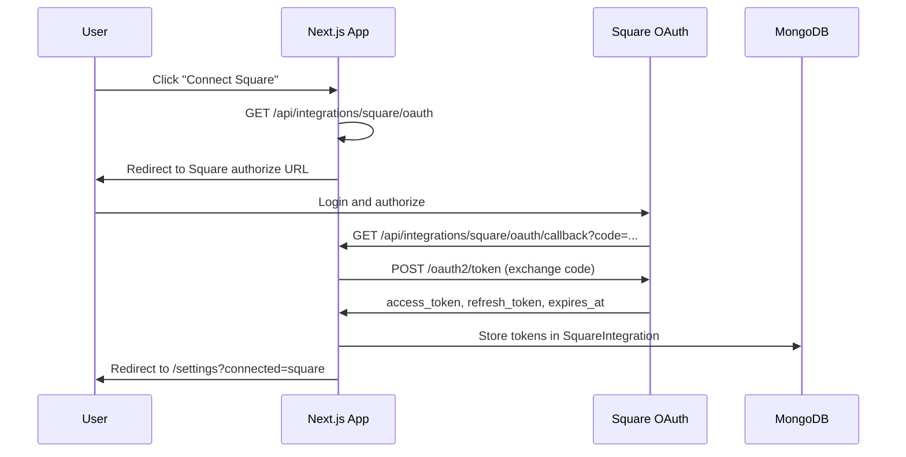

# Square OAuth Integration

Add Square OAuth so each user can connect their own Square account from the Settings page, replacing the static env-var token approach with per-user tokens stored in the database.

## Architecture

The implementation follows the same pattern already used for Gmail OAuth in this codebase: an initiation route generates the authorization URL, Square redirects back to a callback route that exchanges the code for tokens, and tokens are stored per-user in the database.



## 1. Database: Add SquareIntegration Model

Add to `prisma/schema.prisma`:

```prisma
model SquareIntegration {
  id             String    @id @default(auto()) @map("_id") @db.ObjectId
  userId         String    @db.ObjectId
  user           User      @relation(fields: [userId], references: [id], onDelete: Cascade)
  merchantId     String
  accessToken    String
  refreshToken   String
  expiresAt      DateTime
  connected      Boolean   @default(false)
  createdAt      DateTime  @default(now())
  updatedAt      DateTime  @updatedAt

  @@unique([userId])
}
```

Also add `squareIntegration SquareIntegration?` to the `User` model. Run `npx prisma generate` afterward (no migration needed since MongoDB).

## 2. Environment Variables

Add to `.env.example` and `.env`:

- `SQUARE_CLIENT_ID` -- from Square Developer Dashboard > OAuth
- `SQUARE_CLIENT_SECRET` -- from Square Developer Dashboard > OAuth

These are distinct from the existing `SQUARE_ACCESS_TOKEN_PROD` (which is a static personal token). The static token can be kept as a fallback or removed once all users are on OAuth.

## 3. OAuth API Routes

Follow the existing Gmail OAuth pattern from `app/api/inbox/oauth/gmail/`.

### `app/api/integrations/square/oauth/route.ts` (Initiation)

- Verify the user is authenticated via `getCurrentUser()`
- Build the Square authorization URL with scopes: `ORDERS_READ`, `CUSTOMERS_READ`, `MERCHANT_PROFILE_READ`, `PAYMENTS_READ`, `ITEMS_READ`
- Encode `userId` in the `state` param (base64, same as Gmail pattern)
- Return `{ authUrl }` for the frontend to redirect to
- Square authorize URL: `https://connect.squareup.com/oauth2/authorize` (production) or `https://connect.squareupsandbox.com/oauth2/authorize` (sandbox)

### `app/api/integrations/square/oauth/callback/route.ts` (Callback)

- Extract `code` and `state` from query params
- Exchange code for tokens via `POST https://connect.squareup.com/oauth2/token`
- Retrieve merchant ID from the token response
- Upsert `SquareIntegration` record for the user
- Redirect to `/settings?connected=square`

### `app/api/integrations/square/status/route.ts` (Status Check)

- Return the user's Square connection status and merchant info

### `app/api/integrations/square/disconnect/route.ts` (Disconnect)

- Revoke the token with Square's revoke endpoint
- Delete or mark the `SquareIntegration` record as disconnected

## 4. Token Refresh Utility

Add a helper in `lib/square.ts` to handle token refresh:

- Before making any Square API call, check if the token is expired
- If expired, call `POST https://connect.squareup.com/oauth2/token` with `grant_type: refresh_token`
- Update the stored token in the database
- Return the fresh access token

## 5. Update `lib/square.ts` to Use Per-User Tokens

Modify `fetchSquareOrders()` (and any other Square API functions) to:

- Accept a `userId` parameter
- Look up the user's `SquareIntegration` record from the database
- Use the stored access token (refreshing if needed) instead of `process.env.SQUARE_ACCESS_TOKEN_PROD`
- Update all callers (`app/api/square/orders/route.ts`, `app/api/square/sync/route.ts`, `app/api/customer/import/route.ts`) to pass the authenticated user's ID

## 6. Settings Page UI

Add an "Integrations" card to `app/(dashboard)/settings/page.tsx` with:

- Square icon and title
- Connection status indicator (connected/disconnected)
- When disconnected: "Connect Square" button that calls the OAuth initiation endpoint and redirects
- When connected: show merchant ID + "Disconnect" button
- Toast notification on successful connection (check for `?connected=square` query param)

## 7. Middleware

The callback route is under `/api/` so it's already excluded from the auth middleware matcher. No changes needed to `middleware.ts`.

## Files Changed (Summary)

| File | Change |
|------|--------|
| `prisma/schema.prisma` | Add `SquareIntegration` model + relation on `User` |
| `.env.example` | Add `SQUARE_CLIENT_ID`, `SQUARE_CLIENT_SECRET` |
| `lib/square.ts` | Add token refresh helper, update `fetchSquareOrders` to use per-user tokens |
| `app/api/integrations/square/oauth/route.ts` | New -- OAuth initiation |
| `app/api/integrations/square/oauth/callback/route.ts` | New -- OAuth callback |
| `app/api/integrations/square/status/route.ts` | New -- connection status |
| `app/api/integrations/square/disconnect/route.ts` | New -- disconnect |
| `app/api/integrations/square/config/route.ts` | Remove (replaced by OAuth flow) |
| `app/(dashboard)/settings/page.tsx` | Add Integrations card |
| `app/api/square/orders/route.ts` | Pass userId to square lib |
| `app/api/square/sync/route.ts` | Pass userId to square lib |
| `app/api/customer/import/route.ts` | Pass userId to square lib |

## Checklist

- [ ] Add `SquareIntegration` model to Prisma schema and update `User` model with relation
- [ ] Add `SQUARE_CLIENT_ID` and `SQUARE_CLIENT_SECRET` to `.env.example`
- [ ] Create `/api/integrations/square/oauth` route (generates Square authorize URL)
- [ ] Create `/api/integrations/square/oauth/callback` route (exchanges code for tokens, stores in DB)
- [ ] Create `/api/integrations/square/status` and `/disconnect` routes
- [ ] Add token refresh utility to `lib/square.ts`
- [ ] Update `fetchSquareOrders` and callers to use per-user tokens from DB
- [ ] Add Integrations card to Settings page with connect/disconnect Square UI
